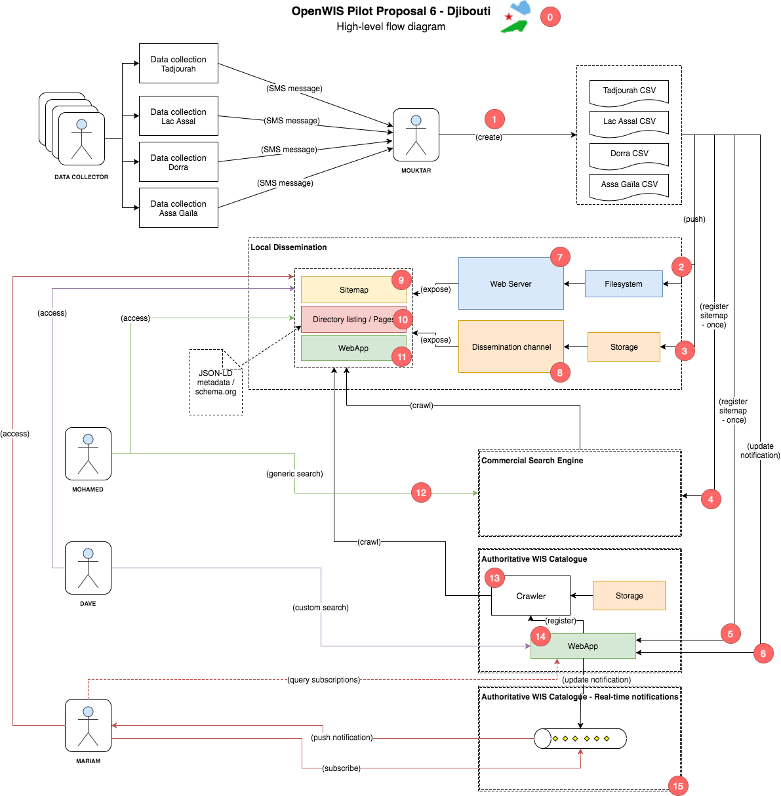
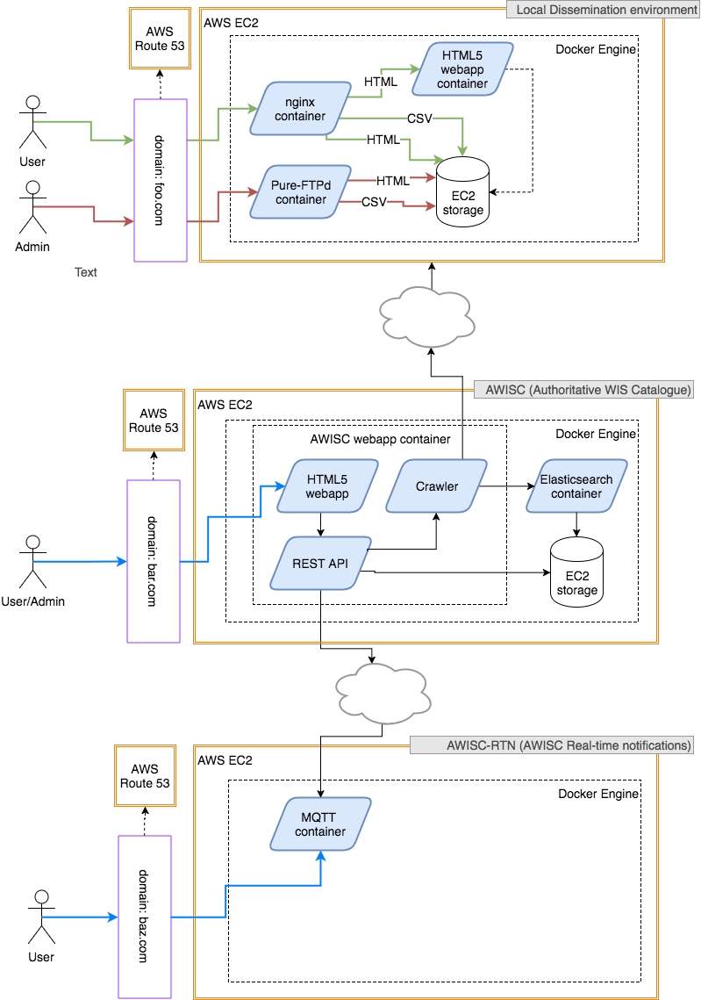

# OPP-6-WIS-Djibouti
For a background regarding OPP-6, please read the relevant [discussion on OPP-6](https://github.com/OpenWIS/openwis-documentation/issues/309).

This repository contains documentation as well as different Proof of Concept implementations for OPP6.

## High-level flow diagram
Presents a bird's eye view of the operations and basic data-flows envisaged for OPP-6. The main actors and actions are identified as well as the main building blocks of the system:

_([edit this diagram](https://www.draw.io/#HOpenWIS%2Fdjibouti%2Fmaster%2Fdocs%2FOPP6-Flow-diagram.xml) in draw.io)_

## PoC architectural specs

### Point 0 - General

1. Q: Implementing security restrictions/checks will not be a target for the PoC. However, should we support some very basic user authentication? Regarding the calls in (P5) and (P6) we could have some basic, token-based authentication in place especially since (P14) will be deployed on public Internet.  
A: Yes. Basic security is required. Discuss with UKMO to re-use part of infrastructure. Security will focus on users like Mouktar and not end-users.

2. Q: Do we want commercial search engines to also crawl AWC?  
A: Not at this point.

3. Q: Do we envisage a central, single AWC or multiple ones? e.g. AWC France, AWC UK, etc.
A: For the pilot, only one.

### Point 1 - Creation of CSVs

1. Q: Should the local WebApp (P11) provide a functionality to create CSVs online?  
A: No.

2. Q: Do we care for the format/columns of the CSVs? Is there a standard to be used?  
A: No.

3. Q: We will need some sample CSVs, who is going to prepare/provide them?  
A: Dom.

### Point 2 - Pushing CSVs to the Web Server
 
1. Q: Do we intend to provide some tool here or is it up to the user?  
A: No.

### Point 3 - Pushing CSVs to a secondary dissemination channel

1. Q: Do we intend to provide some tool here or is it up to the user?  
A: No.

### Point 4 - Registering sitemap with a commercial search engine

1. Q: Which search engine will we pick for the PoC?  
A: Google.

2. Q: We need some info/research here regarding the format/content of the sitemap.  
A: Check if someone has extensive experience in the subject.

3. Q: We need some info/research here regarding the registration process, time to crawl, frequency of updates etc.  
A: Check if someone has extensive experience in the subject.

### Point 5 - Registering sitemap with the AWC

1. Q: Can we use the exact same sitemap as in (P3)? This is largely related to the specs of (P14).  
A: TBD.

### Point 6 - Notifying AWC of data updates

1. Q: Do we envisage anything more complicated than an HTTP/GET call?  
A: Need notification for new data. Optionally, for new metadata.

2. Q: Alternatively, do we need this call or we rely on the Crawler identifying new data (and proceeding to sending notifications)?  
A: See (6.1)

### Point 7 - Local web server

1. Q: For the PoC we need to define the Web Server to be used/supported.  
A: Go for quick :)

### Point 8 - Local secondary dissemination channel

1. Q: Is the secondary dissemination channel something we consider for the PoC? If it is, we need to define what that should be.  
A: No secondary dissemination channel for PoC.

### Point 9 - Generating the sitemap

1. Q: How is the sitemap going to be generated? If not manually, we should investigate tools/methods.  
A: Manually.

### Point 10 - Generating web pages for CSVs

1. Q: How are the pages going to be generated? If not manually, we should investigate tools/methods.  
A: Use HTML templates privided for the PoC.

### Point 11 - The local WebApp

1. Q: What should be the main functionality of the local WebApp?  
A: Simple CSV visualization using existing tools.

### Point 12 - Optimising search queries to the commercial search engine

1. Q: Once we choose the search engine to use, we need to investigate how to query it according to our needs. Can you provide a few representative queries we would like to run?
A: Dom will define a few use/test cases for that.

### Point 13 - AWC crawling local dissemination environments

1. Q: Decide on the crawling mechanism as well as the underlying storage mechanism (this is directly related to the queries to be supported by (P14)).  
A: TBD after P14.

### Point 14 - The AWC WebApp

1. Q: Provide a few indicative queries.  
A: Jeremy will define a few use/test cases for that.

### Point 15 - AWC real-time notifications

1. Q: Is the central approach for real-time notifications the one we want for the PoC?  
A: Yes, central.

2. Q: Real-time notification are about the existance of data, or they disseminate the data itself as well?  
A: No.

## Software components

### Diagram
_([edit this diagram](https://www.draw.io/#HOpenWIS%2Fdjibouti%2Fmaster%2Fdocs%2FOPP6-Software-components.xml) in draw.io)_

### Tasks
For the PoC we have identified three major components of the architecture:

* The Local Dissemination Environment (LDE)
* The Authoritative WIS Catalogue component (AWISC)
* The Authoritative WIS Catalogue Real-time Notification component (AWISC-RTN)

The PoC has very specific focus and will be largely created as a throw-away prototype. It is important to re-use infrastructure and services and not spend time in manual, complicated, one-off setups that require extra documentation. For this reason, we have opted to use Docker, so that we have access to its vast ecosystem of ready-made containers, providing the majority of the underlying components we will need for the PoC. Considering the PoC will be created in a distributed fashion by different teams of the Association, we also opt for using Docker Compose to allow easily reproducible installations across teams and environments.

#### The Local Dissemination Environment (LDE)

##### Infrastructure
Component | Task description | Core Technologies
--|--|--
Storage | Configuration of the required Storage on the target platform (permissions, space allocation) | Ubuntu/CentOS, shell scripting
Web Server | Installation and configuration of the Web Server component, and its pre-requisites | Java, Maven, Karaf

##### Implementation
Component | Task description | Core Technologies
--|--|--
Sitemap | Creation of sitemap | XML
Pages | Creation of static HTML content that will describe each dataset, as well as provide searchable metadata  | HTML, JSON-LD
WebApp | Creation of the web-app that will handle data dissemination, CSV file-upload, and CSV visualization | Java, OSGi, CXF, JavaScript

#### The Authoritative WIS Catalogue component (AWISC)

##### Infrastructure
Component | Task description | Core Technologies
--|--|--
Database | Insallation and configuration of the required Database storage on the target platform (user/schema creation) | MySQL
Web Server | Installation and configuration of the Web Server component, and its pre-requisites | Core technologies: Java, Maven, Karaf

##### Implementation
Component | Task description | Core Technologies
--|--|--
Sitemap | Creation of sitemap | XML
Web Crawler | Creation of the web-crawler service. This will be responsible to index target sites on a schedule, or on-demand | Java
WebApp | Creation of the web-app that will handle user subscriptions, web-crawler control, notification management | Java, OSGi, CXF, JavaScript

#### The Authoritative WIS Catalogue Real-time Notification component (AWISC-RTN)

##### Infrastructure
Component | Task description | Core Technologies
--|--|--
Message Queue | Installation and configuration of the Message Queue component, and its pre-requisites | RabbitMQ